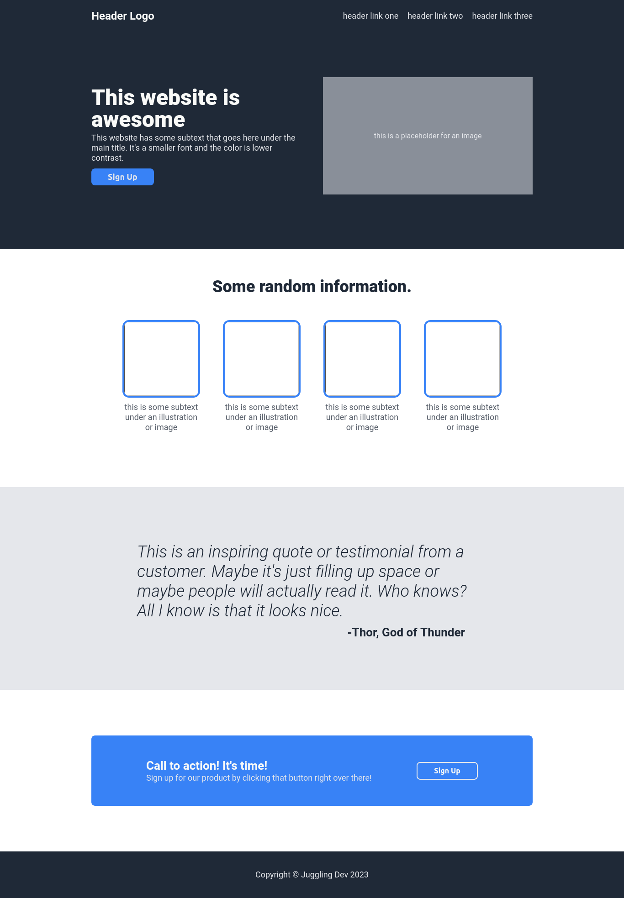

# The Odin Project - Landing Page

This is a solution to the [Project: Landing Page of the Foundations Course](https://www.theodinproject.com/lessons/foundations-landing-page).

## Table of contents

- [Overview](#overview)
  - [Screenshot](#screenshot)
  - [Links](#links)
- [My process](#my-process)
  - [Built with](#built-with)
  - [What I learned](#what-i-learned)
  - [Continued development](#continued-development)
  - [Useful resources](#useful-resources)
- [Author](#author)
- [Acknowledgments](#acknowledgments)

## Overview

### Screenshot

### Links

- Solution URL: [Project: Landing Page solution](https://github.com/jugglingdev/landing-page)
- Live Site URL: [Project: Landing Page live site](https://jugglingdev.github.io/landing-page/)

## My process

### Built with

- Semantic HTML5 markup
- CSS custom properties
- Flexbox
- Google fonts

### What I learned

This project was to make a four-section landing page using Flexbox.  It is currently not responsive and was just designed for desktop.

The desired outcome was provided by [The Odin Project](https://www.theodinproject.com/) as a PNG screenshot.  The color and font information was also provided.

I began by mapping out the sections from the top down.  I found this was helpful because it gave me a big picture view of the project and then helped me tackle each section one by one.  This prevented the project from getting overwhelming and helped set mini-milestones to celebrate.

In the first iteration, I made the `header` separate from the `hero section`.  I later went back and decided to restructure the HTML so that the first `section` included the `header` and `hero`.  I saw online a little inconsistency in how to semantically approach this, so I intend to do more digging in the future.

Two things I really enjoyed practicing in this project were (re)naming classes and cleaning up code.  It's so satisfying when you get clarity during the thinking process and then simplify the craziness.

Something that helped me when cleaning up my CSS in particular was looking from the big picture in.  I started processing where I needed a particular attribute and value starting at the highest level element.

For example, I first had set up padding for each individual `section`, but since I noticed all sections had roughly the same padding, I used one line to set this up for all sections at the top of the CSS.  That way the baseline was set and any section that needed extra space could be dealt with down the cascade.

Overall, this was a very helpful project that serves as a solid template for future builds.

### Continued development

The first thing I would like to do regarding this project is peek at how other developers choose to semantically structure hero headers.

Another thing I'm curious about is commit history.  Many developers have said to commit early and often, but I find that a bit vague.  Do you commit per page completion and then per editing period after that?  Does commit frequency look like every 20 minutes or closer to every 2 hours?  Is once a day enough?  I'd like some clarity on what it means to *commit early* and *commit often*.

Finally, while I knew how to use link pseudo-classes and did so in the header, I'm curious about how to use them for buttons.  It'll be fun to get a bit more interactive with buttons in the future.

### Useful resources

- [Josh W Comeau's Interactive Guide to Flexbox](https://www.joshwcomeau.com/css/interactive-guide-to-flexbox/) - Okay, wow.  I'm amazed by Josh's dedication to educating developers out there.  He has mad front-end skills which significantly enhance his teaching skills.

- [Flex Cheatsheet](https://flexbox.malven.co/) - Great cheatsheet for using Flexbox.

- [Flexbox Froggy](https://flexboxfroggy.com/) - Bring out your inner child as you guide frogs to their lilly pads using Flexbox.

## Author

- GitHub - [@jugglingdev](https://github.com/jugglingdev)

- freeCodeCamp - [@jugglingdev](https://www.freecodecamp.org/jugglingdev)

- Frontend Mentor - [@jugglingdev](https://www.frontendmentor.io/profile/jugglingdev)

- LinkedIn - [Kayla Paden](https://www.linkedin.com/in/kayla-marie-paden)

## Acknowledgments

Shoutout to everyone at The Odin Project for chipping in to make web development education free and accessible for everyone.  Huge thanks to you all!